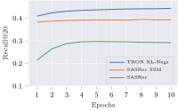
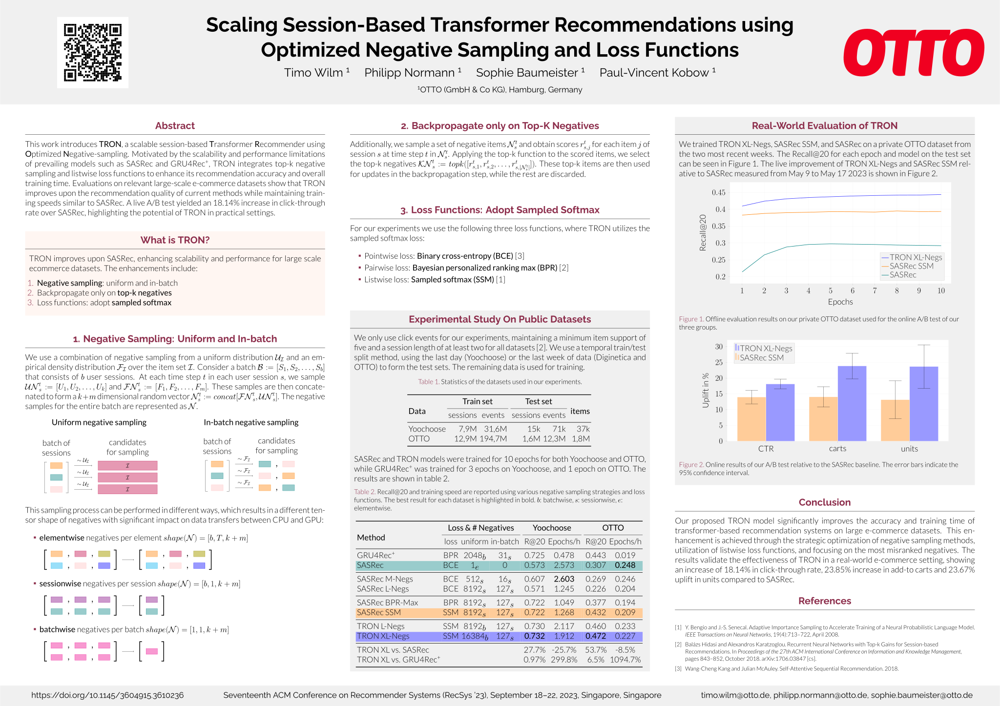

<div align="center">

# TRON: Scalable Session-Based Transformer Recommender using Optimized Negative Sampling

[](https://github.com/otto-de/TRON)
[](https://github.com/otto-de/TRON/actions/workflows/test.yml)
[](https://recsys.acm.org/recsys23/)
[](https://www.otto.de/jobs/technology/ueberblick/)

**TRON is a scalable session-based Transformer Recommender using Optimized Negative-sampling. This repository contains the official [PyTorch Lightning](https://github.com/Lightning-AI/lightning) implementation for our paper: [_Scaling Session-Based Transformer Recommendations using Optimized Negative Sampling and Loss Functions_](https://arxiv.org/abs/2307.14906), authored by [Timo Wilm](https://www.linkedin.com/in/timo-wilm/), [Philipp Normann](https://www.linkedin.com/in/pnormann), [Sophie Baumeister](https://www.linkedin.com/in/sophie-baumeister/), and [Paul-Vincent Kobow](https://www.linkedin.com/in/paul-vincent-kobow/).**


</div>

## 🎯 Abstract

This work introduces **TRON**, a scalable session-based **T**ransformer **R**ecommender using **O**ptimized **N**egative-sampling. Motivated by the scalability and performance limitations of prevailing models such as SASRec and GRU4Rec+, TRON integrates top-k negative sampling and listwise loss functions to enhance its recommendation accuracy. Evaluations on relevant large-scale e-commerce datasets show that TRON improves upon the recommendation quality of current methods while maintaining training speeds similar to SASRec. A live A/B test yielded an **18.14%** increase in click-through rate over SASRec, highlighting the potential of TRON in practical settings. For further research, we provide access to our [source code](https://github.com/otto-de/TRON) and an [anonymized dataset](https://github.com/otto-de/recsys-dataset).

<table style="width:100%">
  <tr style="vertical-align:top">
    <td></td>
    <td></td>
  </tr>
    
  <tr>
    <td>Offline evaluation results on our private OTTO dataset used for the online A/B test of our three groups.</td>
    <td>Online results of our A/B test relative to the SASRec baseline. The error bars indicate the 95% confidence interval.</td>
  </tr>
</table>

## 🌟 RecSys 2023 Research Showcase

Below is our poster presented at the [17th ACM Conference on Recommender Systems](https://recsys.acm.org/recsys23/) (RecSys 2023), which provides a comprehensive overview of the key concepts, methodologies, and results of our TRON research.

<a href=".readme/poster.pdf"></a>

## 🚀 Quick Start

1. Clone the repository:

```bash
git clone https://github.com/otto-de/TRON.git
```

2. Install the dependencies:

```bash
pip install pipenv
pipenv install --dev
```

3. Execute the test scripts:

```bash
pipenv run pytest
```

4. Install 7zip, gzip, and zip utilities on your system:

```bash
sudo apt-get install 7zip gzip unzip
```

5. Prepare a dataset (e.g., yoochoose):

```bash
./prepare.sh yoochoose
```

6. Run the main script with a configuration file:

```bash
pipenv run python -m src --config-filename tron/yoochoose.json
```

## 🗂️ Repository Structure

```yaml
.
├── Pipfile
├── Pipfile.lock
├── README.md
├── configs                # Contains experiment configuration files
├── doc                    # Contains the paper and related files
├── prepare.sh             # Script to prepare datasets
├── src                    # Source code for the models
└── test                   # Test scripts
```

## ⚙️ Config File Documentation

The [config folder](configs/) contains JSON configuration files for all experiments performed in our research. These configurations detail the model's parameters and options.

Here's an explanation of each parameter in the config file:

- `model`: The base model to be used (e.g., "sasrec", "gru4rec").
- `dataset`: The dataset to be used for training (e.g., "yoochoose", "otto", "diginetica").
- `hidden_size`: The size of the hidden layers and item embeddings.
- `num_layers`: The number of layers in the model.
- `dropout`: The dropout rate applied to the model's layers.
- `num_batch_negatives`: The number of negative samples from the batch. Limited by `batch_size` - 1.
- `num_uniform_negatives`: The number of uniformly sampled negatives.
- `reject_uniform_session_items`: If true, items from the same session won't be used as uniform negatives. Becomes slow if `num_uniform_negatives` is large.
- `reject_in_batch_items`: If true, items from the same session won't be used as batch negatives.
- `sampling_style`: The style of negative sampling to use (e.g., "eventwise", "sessionwise", "batchwise"). Has significant impact on training speed.
- `loss`: The loss function to use (e.g., "bce", "bpr-max", "ssm").
- `bpr_penalty`: The penalty factor for BPR-Max loss. Ignored if not using BPR-Max loss.
- `max_epochs`: The maximum number of training epochs.
- `batch_size`: The batch size used for training and validation.
- `max_session_length`: The maximum length of a session. Longer sessions will be truncated.
- `lr`: The learning rate for the optimizer.
- `limit_val_batches`: The fraction of validation data to use for the validation step.
- `accelerator`: The device type to be used for training (e.g., "gpu", "cpu").
- `overfit_batches`: The fraction or number of batches of training data to use for overfitting. Set to 0 for no overfitting. See [PyTorch Lightning docs](https://lightning.ai/docs/pytorch/stable/common/trainer.html#overfit-batches) for more details.
- `share_embeddings`: If true, the embedding weights are shared between the input and output layers.
- `output_bias`: If true, includes bias in the output layer.
- `shuffling_style`: The style of shuffling to use for the training dataset (e.g., "no_shuffling", "shuffling_with_replacement", "shuffling_without_replacement").
- `optimizer`: The optimizer to use for training (e.g., "adam", "adagrad")
- `topk_sampling`: If true, top-k negative sampling is enabled.
- `topk_sampling_k`: If `topk_sampling` is true, this parameter specifies the number of top k negative samples to be used for training.

### Example Config File for TRON on the OTTO Dataset

```json
{
    "model": "sasrec",
    "dataset": "otto",
    "hidden_size": 200,
    "num_layers": 2,
    "dropout": 0.05,
    "num_batch_negatives": 127,
    "num_uniform_negatives": 16384,
    "reject_uniform_session_items": false,
    "reject_in_batch_items": true,
    "sampling_style": "batchwise",
    "topk_sampling": true,
    "topk_sampling_k": 100,
    "loss": "ssm",
    "max_epochs": 10,
    "batch_size": 128,
    "max_session_length": 50,
    "lr": 0.0005,
    "limit_val_batches": 1.0,
    "accelerator": "gpu",
    "overfit_batches": 0,
    "share_embeddings": true,
    "output_bias": false,
    "shuffling_style": "no_shuffling",
    "optimizer": "adam"
}
```

For all config files used in our experiments, refer to the [configs directory](configs/).

## 🙌 Contribution

Contributions to TRON are welcome and appreciated. For issues or suggestions for improvements, please open an issue or create a pull request. We believe that open source knowledge sharing is the best way to advance the field of recommender systems.

## 📖 Citing

If TRON aids your research, please consider citing our work:

```bibtex
@inproceedings{wilm2023tron,
  title={Scaling Session-Based Transformer Recommendations using Optimized Negative Sampling and Loss Functions},
  author={Wilm, Timo and Normann, Philipp and Baumeister, Sophie and Kobow, Paul-Vincent},
  booktitle={Proceedings of the 17th ACM Conference on Recommender Systems},
  doi = {10.1145/3604915.3610236},
  pages={1023--1026},
  year={2023}
}
```

## 📜 License

This project is [MIT licensed](./LICENSE).

## 📞 Contact

For any queries or questions, please reach out to us via our LinkedIn profiles:

- [Timo Wilm](https://www.linkedin.com/in/timo-wilm)
- [Philipp Normann](https://www.linkedin.com/in/pnormann/)
- [Sophie Baumeister](https://www.linkedin.com/in/sophie-baumeister-9a5a59200/)

For specific issues related to the codebase or for feature requests, please create a new issue on our [GitHub page](https://github.com/otto-de/TRON/issues).

If this project aids your research or you find it interesting, we would appreciate it if you could star ⭐ the repository. Thanks for your support!
